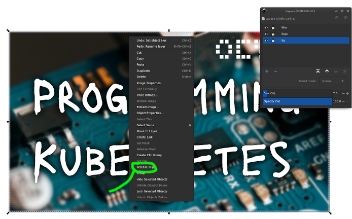
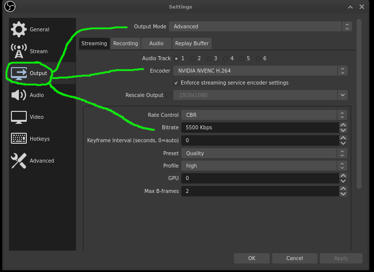

# avg

audio, video, and graphics (avg). This repository contains assets and guides for
generating videos and graphics used in relation to
[octetz.com](https://octetz.com). All graphics are created using free and
open-source software [inkscape](https://inkscape.org) and
[gimp](https://www.gimp.org). 

## Font

Media uses the [Lacquer-Font/Lacquer](https://github.com/Lacquer-Font/Lacquer).
The `.ttf` file is available in the font directory. To install on Linux, do the
following.

```
cp -rv font/lacquer /usr/share/font &&\
sudo chmod 066 /usr/share/font/lacquer
```

## Thumbnail Creation

Thumbnails are used for YouTube and [sometime] re-used as [website summary
cards](https://developer.twitter.com/en/docs/tweets/optimize-with-cards/overview/summary-card-with-large-image). They are created using [inkscape](https://inkscape.org). This assumes you have setup [fonts](#Font).

1. Create a new thumbnail from `svg/yt_thumbnail.svg`.

    ```bash
    cp -v svg/yt_thumbnail.svg ~/Documents/new_thumbnail.svg
    ```

1. Edit the new thumbnail.

    ```bash
    inkscape ~/Documents/new_thumbnail.svg
    ```

1. Select the `bg` layer.

    

1. Select the image object.

1. Right click and choose `Release Clip`.

    

1. Examine the two objects.

    

> The red rectangle represents the 1280x720 space which an image can be clipped
> inside of. The image (triangle) represent what will become the content of that
> clip.

1. Delete the existing image (triangle). 

1. Add a new image.

    

    > Be sure to respect [licensing](https://budgetstockphoto.com/stock_photo_license_types.html).

1. Hit `PgDn` to move the object to the bottom of the layer.

    

    > To see object order in a layer, open `Object > Objects..` from the menu
    > bar.

1. Position the image within the red rectangle based on your preferences.

1. Select the red rectangle and image.

1. Right click and choose `Set Clip`.

    

1. Make needed changes and upload.

    

## OBS Installation

1. Download [obs-studio-git](https://aur.archlinux.org/packages/obs-studio-git).

    ```bash
    cd $(mktemp -d) &&\
    git clone https://aur.archlinux.org/obs-studio-git.git &&\
    cd obs-studio-git
    ```

1. Ensure correct version of
   [cef](https://en.wikipedia.org/wiki/Chromium_Embedded_Framework) is set in
   the depends block of the `PKGBUILD`.

   > see https://aur.archlinux.org/packages/obs-studio-git/#comment-737390

1. Compile and install obs.

    ```bash
    makepkg -si
    ```

## OBS Configuration

### Overview

The octetz.com OBS configuration is a simple `1920x1080` screen with a `400px`
gutter to the right containing the webcam and other assets. The remainder space
is filled with an application, with expected window sizes of `1520x1080`.


### Install This Config

To install this configuration, run the following command. It assumes you've got
all font(s) installed from the [font](#font) section.

```
cp -rv obs/* ~/.config/obs-studio/
```

Images will break, you'll need to replace them or change the paths they're
pointing to in the configuration.

```bash
grep -rF "file" ./obs/basic/
./obs/basic/scenes/octetz.json:                "file": "/home/josh/.config/obs-studio/basic/webcam-bg.jpeg"
./obs/basic/scenes/octetz.json:                "file": "/home/josh/.config/obs-studio/basic/octetz-logo-white.png"
```

### Application Windows

Rather than sharing my desktop with OBS, I share applications windows. Each
window gets its own scene.


This means each application windows being shared should be sized to `1520x1080`.

This is accomplished using
[wmctrl](https://www.freedesktop.org/wiki/Software/wmctrl). To resize the active
window, run:

```bash
wmctrl -r :ACTIVE: -e 0,0,0,1520,1080
```

To speed this up, I've bound the above command to `Super+Shift+1`. My
[~/.bindkeysrc](https://wiki.archlinux.org/index.php/Xbindkeys) is as follows.

```
#resize-obs
"wmctrl -r :ACTIVE: -e 0,0,0,1520,1080"
    m:0x41 + c:10
    Shift+Mod4 + 1
```

### Webcam Video Optimizations

It's important your webcam settings are correct to ensure video comes through at
a good quality and frame rate. A common mistake is to not use an (Emulated)
video format, causing terrible framerates. Per the [obs forums](https://obsproject.com/forum/threads/video-capture-device-v4l2-plugin.17358):

> The v4l2 userspace utilities additionally provide the option of transcoding
> some formats devices may offer but obs is not able to use directly. The
> formats listed as "Emulated" are transcoded from a different input format.
On webcams the emulated formats are MJPEG internally most of the time, which is
a compressed format. Using those formats can help reduce the needed bandwidth
for USB devices and might allow for higher resolutions/framerate.


The key settings to consider are:

* Video Format: `YV12 (Emulated)`
* Resolution: `1280x720`
  * My webcam supports `1080`, but at `30fps`
* Frame Rate: `60.00`

### Slides

For slides, I use [zathura](https://wiki.archlinux.org/index.php/Zathura).


### Switching Between Scenes

While [stream decks](https://www.elgato.com/en/gaming/stream-deck) are really
cool, they're very unnecessary. Additionally their support for Linux is not
native. Simply bind scenes to a key sequence via `File > Settings > Hotkeys`.


### Compositor Warning

If you run a compositor such as compton or
[picom](https://wiki.archlinux.org/index.php/Picom) you may experience issues
with tearing and strange artifacts. Experiments have shown this behavior may
have something to do with my graphics card and vsync, but I'm not entirely sure.

Killing the compositor (`pkill picom`) may solve this problem altogether.

### Video Settings

In `File > Settings > Video` I always ensure base resolution and output resolution match,
or else there can be unintended scaling after recording. For all my recordings,
both are set to `1920x1080`.


In `File > Settings > Output`, the Output Mode is set to `Advanced`. This
enables me to ensure I'm using an encoder with my GPU. Additionally, you can
specify the `Bitrate`, which if streaming may be important for how much data you
can push.



> Settings in the recording tab are the same as streaming.

## Video Editing

I rarely edit videos, when I do, I use [kdenlive](https://kdenlive.org/en/).
